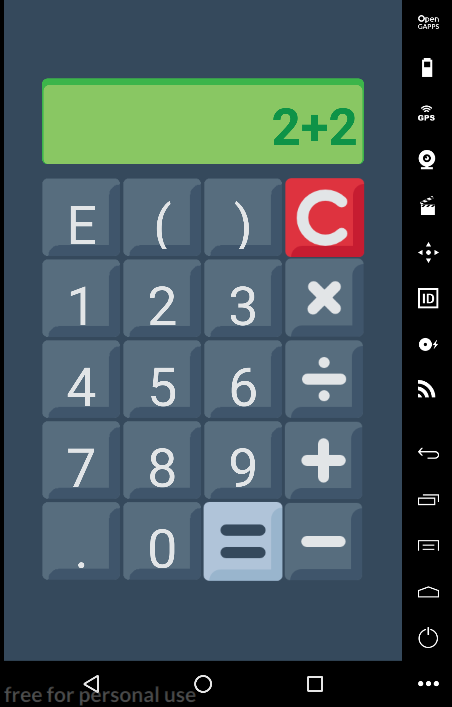

# Calculator.js


A simple and beautiful calculator for android. Maked in [React Native](https://facebook.github.io/react-native/) with [Expo](http://expo.io) tool especialy for my study. In case of bug or error on the aplication, please, send your feedback to me on [issues](/issues)



[](https://github.com/RoboCopGay/Calculator.js/releases)

# Install from source

## Installing dependencies

Before this, you need to install [yarn](https://yarnpkg.com/en/docs/install#debian-stable).

And is just run this command lines

```sh
$ git clone http://github.com/RoboCopGay/Calculator.js
$ cd /path/to/Calculator.js
$ yarn install
```

## Running

### On Android device

You need to install the [expo](https://play.google.com/store/apps/details?id=host.exp.exponent&referrer=www) on your device, after you run (on `path/to/Calculator.js`):

```sh
$ yarn start
```

And on expo app, scan the QR code that will be on web page opened by expo

## Building for android

```
$ expo build:android -t apk
```
